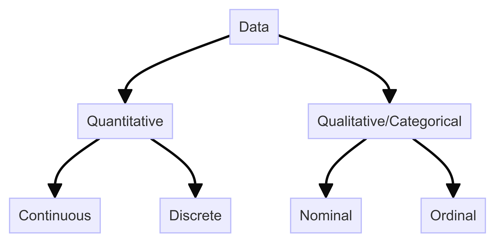
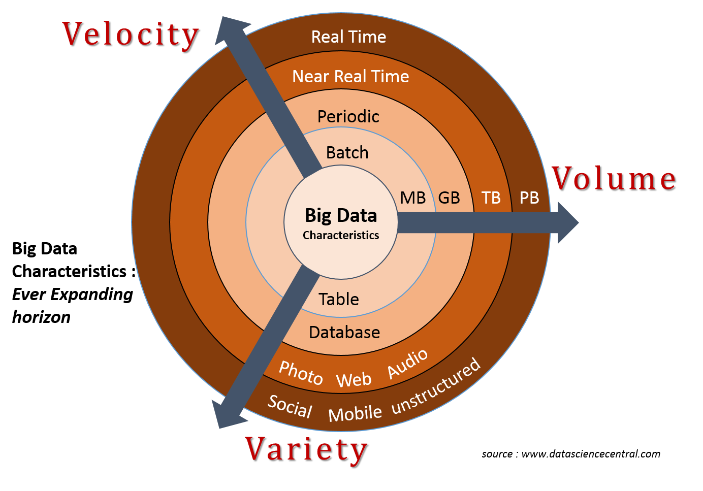

# Data

In common usage, data are a collection of discrete or continuous values that convey information, describing the quantity, quality, facts, statiscs, other **basic units of meaning**, or simply sequences of symbols that may be further interpreted formally.

<!-- more -->

A **datum** is an individual value value in a collection of data. Data are usuallyorganized into structures such as tables that provide additional context and meaning, and which may themselves be used as data in larger structures. 

Data may be used as variables in a computational process. Data may represent abstract ideas or concrete measurements. Data are commonly used in scientific research, economics, and in virtually every other form of human organizational activity. Examples of data sets include price indices (such as consumer price index), unemployment rates, literacy rates, and census data. In this context, data represent the raw facts and figures from which useful information can be extracted.

## Information and Knowledge

Thematically connected data presented in some relevant context can be viewed as *information*. Contextually connected pieces of information can then be described as *data insights or intelligence*. The stock of information, can then be described as *knowledge*. Data have been described as "the new oil of the digital economy".

Data, information, knowledge and wisdom are closely related concepts, but each has its role concerning the other, and each term has its meaning. According to a common view, data is collected and analyzed; data only becomes information suitable for making decisions once it has been analyzed in some fashion. One can say that the extend to which a set of data is informative to someone depends on the extent to which it is unexpected by that person. The amount of information contained in a data stream may be characterized by its Shannon entropy

Knowledge is the awareness of its environment that some entity possesses, whereas data merely communicate that knowledge. For example, the entry in a  database specifying the height of Mount Everest is a datum that communicates a precisely-measured value. This measurement may be included in a book along with other data on Mount Everest to describe the mountain in a manner useful for those who wish to decide on the best method to climb it. An awareness of the characteristics represented by this data is knowledge.

Data is often assumed to be the least abstract concept, information the next least, and knowledge the most abstract. In this view, data becomes information by interpretation; e.g., the height of Mount Everest is generally considered "data", a book on Mount Everest geological characteristics may be considered "information", and a climber's guidebook containing practical information on the best way to reach Mount Everest's peak may be considered "knowledge". "Information" bears a diversity of meanings that ranges from everyday usage to technical use. This view, however, has also been argued to reverse how data emerges from information, and information from knowledge.

Generally speaking, the concept of information is closely related to notions of constraint, communicator, control, data, form, instruction, knowledge, meaning, mental, mental stimulus, pattern, perception, and representation. Beynon-Davies uses the concept of a sign to differentiate between data and information; data is a series of symbols, while information occurs when the symbols are used to refer to something.

---

Before the development of computing devices and machines, people had to manually get data and impose patterns on it. Since the development of computing devices and machines, these devices can also get data. In the 2010s, computers are widely used in many fields to get data and sort or process it, in disciplines ranging from marketing, analysis of social services usage by citizens to scientific research. These patterns in data are seen as information that can be used to enhance knowledge. These patterns may be interpreted as "truth" (though "truth" can be a subjective concept) and may be authorized as aesthetic and ethical criteria in some disciplines or cultures. Events that leave behind perceivable physical or virtual remains can be traced back through data. Marks are no longer considered data once the link between the mark and observation is broken.

---
## Types

Data can be broadly classified into two main types: qualitative and quantitative.

1. **Qualitative/Categorical**: Non-numeric data that describes attributes or properties. Examples include names, labels, and descriptions.
  - **Ordinal**: Categorical data with a meaningful order or ranking but no fixed interval between categories.
  - **Nominal**: Categorical data without any inherent order. It labels variables without a quantitative value.
2. **Quantitative**: Numeric data that can be measured and quantified. Examples include height, weight, and temperature.
  - **Discrete**: Consists of distinct, separate values. It often represents counts and cannot be subdivided meaningfully.
  - **Continuous**: Can take any value within a range. It represents measurements and can be divided into finer levels.

|  |
| :--: |
| *Data Types* |

## Meta-data

The concept of data about data is known as meta-data. It is also useful to distinguish meta-data, that is, a description of other data. A similar yet earlier term for meta-data is "ancillary data". The prototypical example of meta-data is the library catalog, which is a description of the contents of books. It includes:

- **Descriptive** Meta-data: Information describing the content, such as the title, author, and keywords.
- **Structural** Meta-data: Information about the format and structure of the data, such as file types and formats.
- **Administrative** Meta-data: Information about the creation, management, and use of the data, such as copyright details and data provenance

## Representation

Mechanical computing devices are classified according to how they represent data.

- An **analog** computer represents a datum as a voltage, distance, position, or other physical quantity.
- A **digital** computer represents a piece of data as sequence of symbols drawn from a fixed alphabet. The most common digital computers use a binary alphabet, that is, an alphabet of two characters typically denoted "0" and "1".

More familiar representations, such as numbers or letters, are then constructed from the binary alphabet. Some special forms of data are distinguished. A computer program is a collection of data, which can be interpreted as instructions. Most computer languages make a distinction between programs and the other data on which programs operate, but in some languages, notably Lisp and similar languages, programs are essentially indistinguishable from other data.

## Challenges in a data system

As a reference architecture is abstract and designed with generality in mind, it is applicable in different contexts, where the concrete requirements of each context guide the adoption into a concrete architecture. The level of abstraction can however differ between reference architectures and with it the concreteness of guidance a reference architecture can offer

### Acquisition (Collection and/or Extraction)

Data are acquisited using techniques such as measurement, observation, query or analysis, and are typically represented as numbers or characters which may be further processed.

Gathering data can be accomplished through a primary source (the research is the first person to obtain the data) or a secondary source (the researcher obtains the data that has already been acquisited by other sources, such as data disseminated in a scientific journal).

1. **Field data** are data that are gathered in an uncontrolled in-situ enviroment.
2. **Experimental data** are data that are generated in the course of a controlled scientific experiment.

We have two types of the data acquisition:

1. **Collection** is the acquisition of data in **motion**. The acquisition includes capabalities to "subscribe" to a data stream or to simulate the stream via quickly repeating API calls. if it is subscribed then data will be pushed  to it. Once the data is collected, it may then store it temporarily in-memory or a disk before passing it to Stream processor for near real-time processing of data. Data can also go through filtration before it being fed to the Stream processor. Data Collection aims at acquiring data in motion.

2. **Extraction** is the acsition of data **at rest**. It is primarily a pull mechanism to feed the data into a system. It can also refer to crawling data from web pages. Data can be extracted from structured, semi-structured and unstructured data sources. Data extraction aims at acquiring static data.

---
Data are analyzed using techniques such as calculation, reasoning, discussion, presentation, visualization, or other forms of post-analysis. Prior to analysis, raw data (or unprocessed data also known as primary data) are typically cleaned: Outliers are removed and obvious instrument or data entry errors are corrected.

Data analysis methodologies vary and include data triangulation and data percolation. The latter offers an articulate method of acquiring, classifying, and analyzing data using five possible angles of analysis (at least three) to maximize the research's objectivity and permit an understanding of the phenomena under investigation as complete as possible: qualitative and quantitative methods, literature reviews (including scholarly articles), interviews with experts, and computer simulation. The data is thereafter "percolated" using a series of pre-determined steps so as to extract the most relevant information.

---

### Processing

Data processing is the execution of a function that receives a given data set as input, and that function will perform an action and/or return another data set as output.

The data processing infrastructure that was developed to run business operations over the past decades is having trouble keeping pace with today's digital alndscape. Across every industry daily interactions and transactions are moving online and the business services are becoming increasingly automated. Volumes of multi-structured, machine-generated data from a variety of sources have skyrocketed,  and smart companies want to capture and make use of it all. As data volumes grow and the complexity of data types and sources increases, data processing workloads take longer to run and the time available and analysis is reduced.

The magnitude of 3Vs (Volume, Velocity and Variety) determines the computation power required to process data. Imagine the computational power required to process 20 petabytes of data within a day by Google, or analyzing 200 million tweets per day to derive trending topics on Twitter, or NYT processing 4TB worth of raw images into 11 Million finished PDFs in 24 hrs. So the challenge is not only because of tremendous volume of data, but also the speed (velocity) at which it is generated and the variety of sources from which it is produced.

Various traditional technologies are available for high-perfromance computing which includes Cluster COmputing and Grid Computing. However, high cost of Cluster and non-reliability of Grid Computing make them unsuitable for Data processing. Cloud computing which though seems to be an ideal solution for Data processing too puts up constraints such as the need to transfer huge volumes of data across network.

The challenges for high-performance computing is on following parameters:

- **Linear Horizontal Scalability:** The system should be able scale horizontally. More importantly than a system being scalable is a system being linearly scalable. A linear scalable system can maintain performance under increased load by adding resources in proportion to the increased load. A non-linear scalable system, while "scalable", isn't particular useful as it may not be feasible;
- **Cost Effectiveness:** Economy of Scale is the most important criteria that need to be satisfied by any computation solution for data procesisng. Suppose the number of machines required in relation to the load on a system has a quadratic relationship, like in figure. Increasing the load ten folds would increase costs by a hundred. Such systems usually are not feasible from business perspective;
- **Performance:** The system has to process data at an acceptable performance.  The various technologies used to process big data should be able to utilize the resource very efficiently in order to produce high throughput per unit of resource. Resources come with a cost, so it becomes important that economy of scale is maintained throughout the product life cycle. Example of resources are Memory, CPU, Network bandwith, etc;
- **Minimum data transfer:** The architecture of data computing approach should restrict the movement of data over network. The computation needs to be taken near to data and not vice versa;
- **Fault tolerance:** It should be possible for the system to continue the processing of data in the event of the failure of a part. Failures may be due to network partition, server crashes and disk breakdowns;
- **Auto Elasticity:** It is ability of the resource to adjust to the incoming load. Resources should be able to scale up or scale down based as per the requirements at a given point of time;
- **Latency:** Latency is the delay within a system based on delays in execution of a task There is always a timeliness associated to an information that makes it valuable. So it very important that the latency of the system is such that data is available on time. Consistence and predictability in performance is very critical for data system especially the ones that perform analytics on the data. Latency is an issue in every aspect of computing, including communications, data management, system performance, and more. It can become a major challenge in real time and near-real-time applications.

### Storage

Companies today store large volumes of diverse data from web logs, click streams, sensors, and many other sources. The volume of this data crosses many terabytes and petabytes at times. Technically it is possible to store this amount of data on disks, however, challenge lies in cost effective means of data storage.

The various types of data storage provided in Data Store are as following

- Distributed File System
- RDBMS
- NoSQL
- In-Memory Databases (NewSQL)
- Encrypted Databases

A Data storage solution should overcome the following challenges

- **Preventing data loss:** When storage systems reach hundreds of terabytes in scale, derive failures and errors present a constant challenge. The traditional approach to protecting data against these failures is replication - creating one or more copies of the data to ensure that there is always a backup available in case of data loss. However, creating copies of the data eventually becomes difficult to sustain from a cost and administration standpoint. For instance, Cleversafe, Inc. published a paper that describes how current storage system based on RAID arrays were not designed tos cale to this type of data growth. As a result, the cost of RAID-based storage systems increases as the total amount of storage increases, while data protection degrades, resulting in permanent digital asset loss. With the capacity of storage devices today, RAID-based systems cannont protect data from loss. Most IT organizations using RAID for big storage incur additional cost to copy their data two or three times to protect it from inevitable data loss.
- **Maintain High Availability of System:** End users and customers have grown to expect 24/7 access to data-downtime is unacceptable. Data must always be available during sotrage systems upgrades, drive failures, network outages-even during the failure of an entire data center.
- **Protecting data from unathorized access:** Data must be protected from unauthorized access, both when it's "at rest" and when it's traversing the network. The massive scale of big data makes it difficult for organizations to identify and address potential security threats.
- **Managing Economy of Scale:** Storage devices conitnue to grow in terms of capacity while declining in price (more bits per device at a lower cost). However, even as the price of cpaacity declines, the cost to power, cool, house, connect and manage that capacity continues to pose a challenge to budgets.

### Security and Privacy

Data security and privacy deliver data protection across enterprise. Together, they comprise the people, process and technology required to prevent destructive forcces and unwanted actions.

**Data security** is protecting data, information, and systems from unauthorized access, use, disclosure, disruption, modification, or destruction in order to provide:

- *Integrity:* Guarding against improper data modification or destruction, and includes ensuring data non-repudiation and authenticity;
- *Confidenciality:* Preserving authorized restrictions on access and disclosure, including means for protecting personal privacy and proprietary data;
- *Availability*: Ensuring timely and reliable access to and use of data.

**Data privacy** is the assured, proper, and consistent collection, processing, communication, use and disposition of data associatede with personal information (PI) and personally-identifiable information (PII) throughout its life cycle.

Security and Privacy are the major concerns in the data apllications. Application domains are health care, finance, governance and many other both from private and public sectors. These domains deal with very sensitive infomration suchc as Personal Health Record, Credit History, Personal Identity, etc. This data needs to be protected both to meet compliance requirements of each domain and to ensure the privacy of individuals.

### Governance and Management

Data systems gives enterprises ability to access, aggregate and analyze ever increasing amounts of data.It is an enormous opportunity to make information the leader of value creation, but without comprehensive principles, policies and frameworks, Data system can generate enormous risks. Data System needs governance framework that ensures trustworthy data practices. Without propoer governance, the same data that brings value to the organization, can also bring misfortune if its security and privacy is compromised. With effective data/information governance in place, business stakeholds tend to have greater trust and confidence in data. There is complete accountability throughout the lifecycle of information.

The volume of information coming into most companies has exploded in recent years, and many IT shops are dealing with extremely large data sets. It makes Data Governance and Management as the continuously evolving process. With data being stored for analytics, storage management tasks keep on growing. More drives and devices are needed to house the data. And to ensure high performance server CPUs are satiated, data must be slectively stored and moved to different storage tiers to meet the varying I/O and throughput performance characteristics of each application.

Business Intelligence extracted from new types of growing volumes of data has led companies to use dedicated systems optimized for the different business. This approach can make inefficient use of storage. Spare capacity in one effort goes idle, while another group's effort requires buying additional capacity. This increases CAPEX spending and its impact on IT budgets is compounded by an associated increase in OPEX costs as the added devices must be managed and amintained, take data center space, and must be powered and cooled.

This approach also results in siloing which further complicates the matter. Siloing also prevents organizations from realizing the advantages of a whole-company view of its data. Additionally, since of the same data (a costumer sales database or stock market indices, for example) might be used by different groups for different purposes, having multiple versions of this data increases the total data volume.  It also increases the need for multiple data entry, which contriibutes to multiple versions of the truth.

Making matters worse, by using an optimized storage solution to match the various analytics application's performance needs, there are often different storage product lines used throughout the organizations. Each type of storage system would typically have it sown storage managemnet system. This is often the case even if all of the systems come from one vendor.

All this had led to development of new tools to manage Data.

### Data Transfer

Traditional WAN-based transport methods cannot move terabytes of data at the speed dictated by businesses; they use a fraction of available bandwidth and achieve transfer speeds that are unsuitable for such volumes, introducing unacceptable delays in moving data around. It is also not logical to move around terabytes of data in a day for processing on differents nodes.

Other methods like moving the data physically by writing it to a disk and then transporting the physical disk too have limitations as by the time data reaches to a processing facility, it amy have already changed.

New innovative techniques need to be employed to minimize transfer of data over the network.

## Big Data

Advances in computing technologies have led to the advent of big data, which usually refers to very large quantities of data, usually at the petabyte scale. Using traditional data analysis methods and computing, working with such large (and growing) datasets is difficult, even impossible.

Doug Laney attribute 3Vs to data. They are Velocity, Volume and Variety. In other words high Volume, Velocity and Variety (3 Vs) are the attributes of a data that characterize it into a Big Data.

Theoretically speaking, infinite data would yield infinite information, which would render extracting insights or intelligence impossible.

In response, the relatively new field of data science uses machine learning (and other artificial intelligence - AI) methods that allow for efficient applications of analytic methods to big data.

{{ footer(page.meta) }}