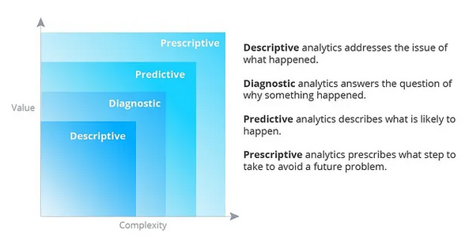
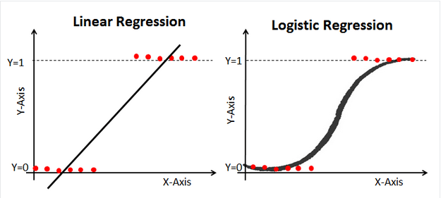
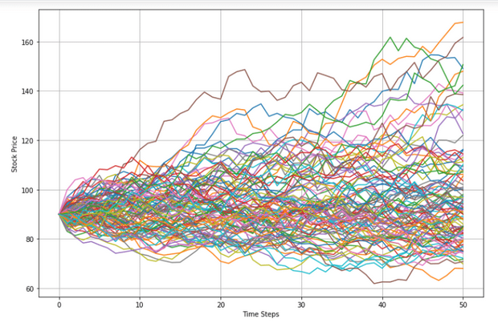
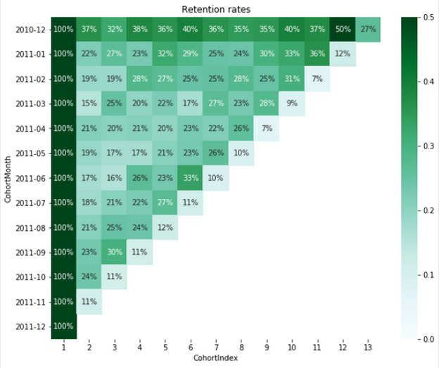

# Data Analysis

Data analytics are the processes that involves extracting meaningful insights from raw data to drive decision-making processes. It includes a wide range of techniques and disciplines ranging from the simple data compilation to advanced algorithms and statistical analysis.

Data analysis is not just a mere process; it's a tool that enables data analysts to support businesses in identifying trends, making informed decisions, predicting potential outcomes - hence playing a crucial role in shaping business strategies. It's the backbone of strategic planning in businesses, governments, and other organizations.

## Importance

In the era of digital transformation, data analysis has become more critical than ever. The explosion of data generated by digital technologies has led to the advent of what we now call 'big data.' This vast amount of data, if analyzed correctly, can provide invaluable insights that can revolutionize businesses.

**Data analysis is the key to unlocking the potential of big data**. It helps organizations to make sense of this data, turning it into actionable insights. These insights can be used to improve products and services, enhance experiences, streamline operations, and increase profitability.

A good example is the healthcare industry. Through data analysis, healthcare providers can predict disease outbreaks, improve patient care, and make informed decisions about treatment strategies. Similarly, in the finance sector, data analysis can help in risk assessment, fraud detection, and investment decision-making.

## Process

The process of data analysis is a systematic approach that involves several stages, each crucial to ensuring the accuracy and usefulness of the results. Here, we'll walk you through each step, from defining objectives to data storytelling.

### 1. Defining objectives and questions

The first step in the data analysis process is to define the objectives and formulate clear, specific questions that your analysis aims to answer. This step is crucial as it sets the direction for the entire process. It involves understanding the problem or situation at hand, identifying the data needed to address it, and defining the metrics or indicators to measure the outcomes.

### 2. Data collection

Once the objectives and questions are defined, the next step is to collect the relevant data. This can be done through various methods such as surveys, interviews, observations, or extracting from existing databases. The data collected can be quantitative (numerical) or qualitative (non-numerical), depending on the nature of the problem and the questions being asked.

### 3. Data cleaning

Data cleaning, also known as data cleansing, is a critical step in the data analysis process. It involves checking the data for errors and inconsistencies, and correcting or removing them. This step ensures the quality and reliability of the data, which is crucial for obtaining accurate and meaningful results from the analysis.

### 4. Data analysis

Once the data is cleaned, it's time for the actual analysis. This involves applying statistical or mathematical techniques to the data to discover patterns, relationships, or trends. There are various tools and software available for this purpose, such as Python, R, Excel, and specialized software like SPSS and SAS.

### 5. Data interpretation and visualization

After the data is analyzed, the next step is to interpret the results and visualize them in a way that is easy to understand. This could involve creating charts, graphs, or other visual representations of the data. Data visualization helps to make complex data more understandable and provides a clear picture of the findings.

### 6. Data storytelling

The final step in the data analysis process is data storytelling. This involves presenting the findings of the analysis in a narrative form that is engaging and easy to understand. Data storytelling is crucial for communicating the results to non-technical audiences and for making data-driven decisions.

## Types

Data Analytics has proven to be a critical part of decision-making in modern business ventures. It is responsible for discovering, interpreting, and transforming data into valuable information. Different types of data analytics look at past, present, or predictive views of business operations.

Data Analysts, as ambassadors of this domain, employ these types, which are namely Descriptive Analytics, Diagnostic Analytics, Predictive Analytics and Prescriptive Analytics, to answer various questions — What happened? Why did it happen? What could happen? And what should we do next? Understanding these types gives data analysts the power to transform raw datasets into strategic insights.

| Question | Analysis type |
| -- | -- |
| What happened? | Descriptive | # Present
| Why did it happen? | Diagnostic | # Past
| What could happen? | Predictive | # Future
| What should we do? | Prescritive | # Decision making

### 1. Descriptive

Descriptive Analytics is one of the fundamental types of Data Analytics that provides insight into the past. As a Data Analyst, utilizing Descriptive Analytics involves the technique of using historical data to understand changes that have occurred in a business over time. Primarily concerned with the “what has happened” aspect, it analyzes raw data from the past to draw inferences and identify patterns and trends. This helps companies understand their strengths, weaknesses and pinpoint operational problems, setting the stage for accurate Business Intelligence and decision-making processes.

### 2. Diagnostic

Diagnostic analytics, as a crucial type of data analytics, is focused on studying past performance to understand why something happened. This is an integral part of the work done by data analysts. Through techniques such as drill-down, data discovery, correlations, and cause-effect analysis, data analysts utilizing diagnostic analytics can look beyond general trends and identify the root cause of changes observed in the data. Consequently, this enables businesses to address operational and strategic issues effectively, by allowing them to grasp the reasons behind such issues. For every data analyst, the skill of performing diagnostic data analytics is a must-have asset that enhances their analysis capability.

### 3. Predictive

Predictive analysis is a crucial type of data analytics that any competent data analyst should comprehend. It refers to the practice of extracting information from existing data sets in order to determine patterns and forecast future outcomes and trends. Data analysts apply statistical algorithms, machine learning techniques, and artificial intelligence to the data to anticipate future results. Predictive analysis enables organizations to be proactive, forward-thinking, and strategic by providing them valuable insights on future occurrences. It’s a powerful tool that gives companies a significant competitive edge by enabling risk management, opportunity identification, and strategic decision-making.

### 4. Prescriptive

Prescriptive analytics, a crucial type of data analytics, is essential for making data-driven decisions in business and organizational contexts. As a data analyst, the goal of prescriptive analytics is to recommend various actions using predictions on the basis of known parameters to help decision makers understand likely outcomes. Prescriptive analytics employs a blend of techniques and tools such as algorithms, machine learning, computational modelling procedures, and decision-tree structures to enable automated decision making. Therefore, prescriptive analytics not only anticipates what will happen and when it will happen, but also explains why it will happen, contributing to the significance of a data analyst’s role in an organization.

## Technicques

There are numerous techniques used in data analysis, each with its unique purpose and application. Here, we will discuss some of the most commonly used techniques, including exploratory analysis, regression analysis, Monte Carlo simulation, factor analysis, cohort analysis, cluster analysis, time series analysis, and sentiment analysis.

### Exploratory analysis

Exploratory analysis is used to understand the main characteristics of a data set. It is often used at the beginning of a data analysis process to summarize the main aspects of the data, check for missing data, and test assumptions. This technique involves visual methods such as scatter plots, histograms, and box plots.

## Regression  analysis

Regression analysis is a statistical method used to understand the relationship between a dependent variable and one or more independent variables. It is commonly used for forecasting, time series modeling, and finding the causal effect relationships between variables.

|  |
|:--:|
| *Linear and logistic regression* |

### Factor analysis

Factor analysis is a technique used to reduce a large number of variables into fewer factors. The factors are constructed in such a way that they capture the maximum possible information from the original variables. This technique is often used in market research, customer segmentation, and image recognition.

### Monte Carlo simulation

Monte Carlo simulation is a technique that uses probability distributions and random sampling to estimate numerical results. It is often used in risk analysis and decision-making where there is significant uncertainty.

|  |
| :--: |
| *Example of a Monte Carlo simulation* |

### Cluster analysis

Cluster analysis is a technique used to group a set of objects in such a way that objects in the same group (called a cluster) are more similar to each other than to those in other groups. It is often used in market segmentation, image segmentation, and recommendation systems.

### Cohort analysis

Cohort analysis is a subset of behavioral analytics that takes data from a given dataset and groups it into related groups for analysis. These related groups, or cohorts, usually share common characteristics within a defined time span. This technique is often used in marketing, user engagement, and customer lifecycle analysis.

|  |
| :--: |
| *Graph showing an example of cohort analysis* |

### Time series analysis

Time series analysis is a statistical technique that deals with time series data, or trend analysis. It is used to analyze the sequence of data points to extract meaningful statistics and other characteristics of the data. This technique is often used in sales forecasting, economic forecasting, and weather forecasting.

### Sentiment analysis

Sentiment analysis, also known as opinion mining, uses natural language processing, text analysis, and computational linguistics to identify and extract subjective information from source materials. It is often used in social media monitoring, brand monitoring, and understanding customer feedback.

{{ footer(page.meta) }}